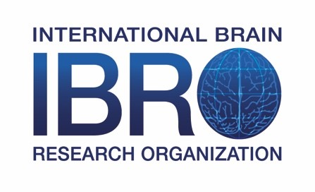

**Applications for 2022 are now closed. Thanks to everyone who applied. We will announce the participants soon**

**Objectives**: Introduce tools that are essential for starting work in computational neuroscience. It includes pre-requisite knowledge such as programming with Python, linear algebra, calculus, statistics, and basic neuroscience.

# Instructors

* [Samar ElSheikh](https://twitter.com/SamarElsheikh) (Centre for Addiction and Mental Health)
* [Rawan AlSubaie](https://twitter.com/rawryy) (King Fahad Medical City/UCL)
* [Moataz Assem](https://twitter.com/moatazassem) (University of Cambridge)
* [Yahia H. Ali](https://yahiaali.com/) (Emory University and Georgia Tech)
* [Sarah Hosni](https://twitter.com/sarahihosni) (University of Rhode Island and Old Dominion University)
* [Mohamed Abdelhack](https://mabdelhack.github.io/) (Krembil Centre for Neuroinformatics)
* [Ramzi Halabi](https://www.linkedin.com/in/ramzihalabiphd/) (Krembil Centre for Neuroinformatics)

# Course materials

- [Welcome Video](https://youtu.be/o60MAFIi44M)
- [**Tutorials**: videos, notebooks, and slides (TBA)](#)

# Course outline

#### Week 1
* Mon, June 13: Python Day 1
* Tue, June 14: Python Day 2
* Wed, June 15: Basics of Neurosciences
* Thu, June 16: Neural Data
* Fri, June 17: Linear Algebra Day 1 (Vectors)

#### Week 2
* Mon, June 20: Linear Algebra Day 2 (Matrices)
* Tue, June 21: Linear Algebra Day 3 (Eigen Values and Eigen Vectors)
* Wed, June 22: Calculus (Differentiation and Integration)
* Thu, June 23: Statistics Day 1 (Probability)
* Fri, June 24: Statistics Day 2 (Inference)

----

# Daily schedule
<iframe src="https://calendar.google.com/calendar/embed?src=5nvg7s13rchqsi8g0nvo5tgbj0%40group.calendar.google.com" style="border: 0" width="800" height="600" frameborder="0" scrolling="no"></iframe>

To avoid confusion, you can import the above calendar to your own Google calendar. It currently shows the times according to Eastern time but if you import it, it will convert to your local timezone.

0:00 time here corresponds to the starting time of the day. This time is depending on your location is as follows:
* (UTC +0) Morocco and Mauritania: 4:00 PM
* (UTC +1) Algeria, Tunisia: 5:00 PM
* (UTC +2) Libya, Sudan and Egypt: 6:00 PM
* (UTC +3) Palestine, Lebanon, Syria, Saudi Arabia: 7:00 PM
* (UTC +4) UAE, Kuwait, Oman, Bahrain, Qatar: 8:00 PM

## Python Days
They are whole workshop days. The day in total is composed of 5 hours of tutorials including a 1 hour break in the middle.
First day includes a welcome video to be watched offline before joining.

|    Time (Hour)   |    Lecture                            |
|------------------|---------------------------------------|
|    0:00-2:00   |    Tutorials   |
|    2:00-3:00     |    Break                  |
|    3:00-5:00     |    Tutorials        |

## Neuroscience Days
Neuroscience days are composed of lectures that are recorded to be watched offline and a live Q&A session with the instructors.

|    Time (Hour)   |    Lecture                            |
|------------------|---------------------------------------|
|    1:00-2:00     |    Live Q&A                                |

## Linear Algebra, Calculus, Statistics Days
These days will include a lecture to be watched offline before as well as tutorials to be conducted live. The last day contains also a live outro conclusion of the course.

|    Time (Hour)   |    Lecture                            |
|------------------|---------------------------------------|
|    0:00-2:00   |    Tutorials   |
|    2:00-3:00     |    Break                  |
|    3:00-5:00     |    Tutorials        |

# Proudly supported by

# Partners

